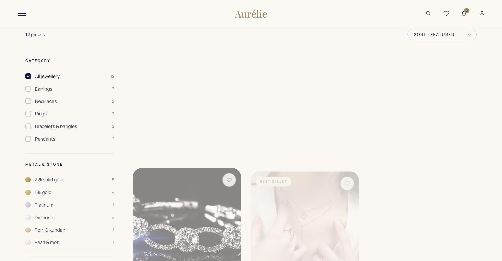
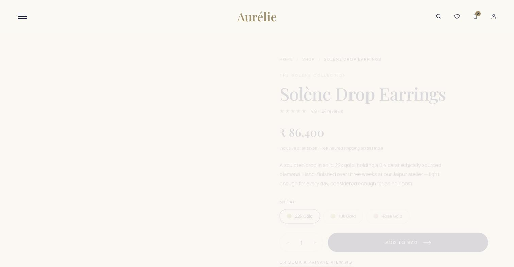

<div align="center">

# 💍 Aurélie — Fine Jewellery

**A hand-crafted static jewellery site, ported byte-faithfully into a modern Next.js app**

A full luxury e-commerce frontend — shop, product detail, cart, 3-step checkout,
account dashboard, wishlist, editorial journal — rebuilt on the Next.js App
Router from an original static HTML/CSS/GSAP design, with **zero visual or
behavioral drift** from the source.

[](https://github.com/bhushan1934/Aurelie-jewellery)


</div>

<br>


<br>

## What this is

A client came in with a fully designed static jewellery site — hand-built
HTML/CSS pages with GSAP scroll animation, a distinct editorial voice, and a
real e-commerce flow (shop → cart → checkout → account) — but no app
framework, no routing, and no way to grow it into a real product.

The job: **move it onto Next.js without touching a single pixel.** Every
page needed to render *exactly* as designed — same markup, same animation
timing, same internal links — while gaining real App Router routes,
production builds, and a foundation that can take a real backend later.

<br>

## How the port works

Rather than hand-translating fifteen hand-built pages into React components
(and inevitably drifting from the original), this takes a more faithful
approach:

1. **`scripts/generate.mjs`** reads each original `.html` file and splits it
   into `content/<page>.json` — the page's head styles/links + body markup,
   and an **ordered list of its `<script>` tags** (external vs. inline, with
   type and src preserved).
2. **`components/RawPage.jsx`** injects that markup as-is via a single
   client component, then replays the scripts *in their original document
   order* — external scripts are de-duplicated and awaited before the next
   one runs, so load-order dependencies (GSAP core before
   `aurelie-gsap.js`, for example) are preserved exactly as the static page
   had them.
3. **`next.config.js`** rewrites every old `*.html` link (`shop.html`,
   `product.html`, …) to its new route, so internal navigation inside the
   original markup keeps working without editing the markup itself.

The result: fifteen real Next.js routes, each rendering its original page
byte-for-byte, animating on scroll exactly as designed, with no React
re-implementation to drift out of sync with the source.

<br>

## Page tour



**Shop** — 12-piece catalogue with live category filters (earrings,
necklaces, rings, bracelets & bangles, pendants) and metal/stone filters
(22k/18k gold, platinum, diamond, polki & kundan, pearl), sort control, and
hover-reveal product cards with a "best seller" tag and wishlist toggle.



**Product detail** — rating/reviews, metal variant selector, quantity
stepper, "Add to bag" and "Book a private viewing" CTAs, certification
badges (BIS hallmark, certified diamond), a full materials/care/shipping
accordion, and a "complete the look" related-products rail.

**Cart & checkout** — the bag holds a quoted price for 48 hours against the
day's gold rate; checkout is a 3-step flow (address → payment → review) with
four payment methods (UPI, card, net banking, cash on delivery up to
₹1,00,000) and full Indian-state address fields.

**Account dashboard** — order history (current + past, with tracking and
invoice), editable profile, saved addresses and cards, wallet balance and
reward-points redemption, active coupon codes, and an activity/notification
feed.

**Wishlist** — saved pieces re-priced daily against the market gold rate,
each with a one-click "move to bag" that locks in a 48-hour quote.

**Journal** — a categorized editorial section (craftsmanship, heritage,
care, people) with a featured story, author/date/read-time metadata, and
individual article pages.

Plus: about, contact, FAQ, login, privacy and terms — all ported the same
faithful way.

<br>

## Tech stack

| Layer | Choice |
|---|---|
| Framework | Next.js 14 (App Router) |
| UI | React 18, original hand-written CSS (no component library, nothing rewritten) |
| Animation | GSAP (loaded and sequenced exactly as the original pages did) |
| Content | Static JSON per route, generated from the original HTML — no CMS, no database (this is a frontend port; see Notes) |

<br>

## Running it locally

```bash
npm install
npm run dev     # http://localhost:3000
```

```bash
npm run build && npm start    # production build
npm run gen                   # regenerate content/*.json if the original .html files change
```

<br>

## Notes

- **Frontend only** — this port covers the static/markup layer. The
  original `.php` files (if any backend logic existed) were not ported;
  cart/checkout/account state in this build is presentational, matching
  what the static design showed.
- Draft/alternate originals (`* v1.html`, `Shail v4.html`, standalone demo
  pages) were intentionally left out since nothing in the live site links to
  them — add a row to `PAGES` in `scripts/generate.mjs` and a route folder
  to bring any of them back in.

<br>

## License

All rights reserved — see [`LICENSE`](LICENSE). This repository is shared
for portfolio/review purposes; it is not licensed for reuse, redistribution,
or derivative work. The Aurélie brand and jewellery imagery belong to the
client and are included here solely as part of this engagement.
